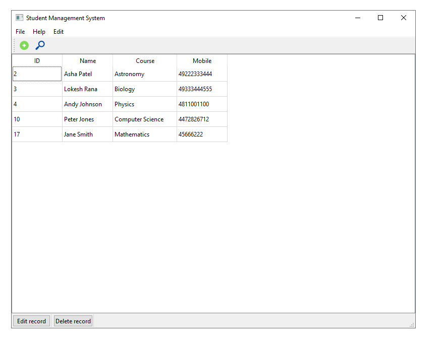
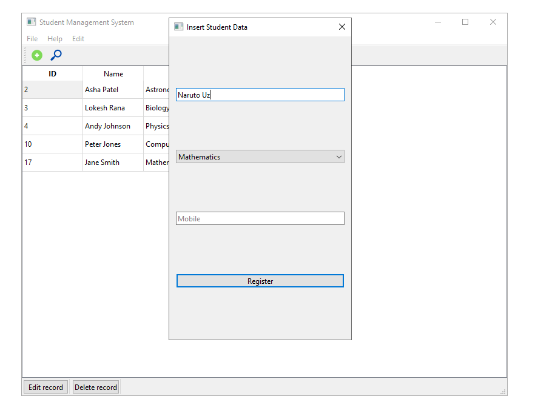
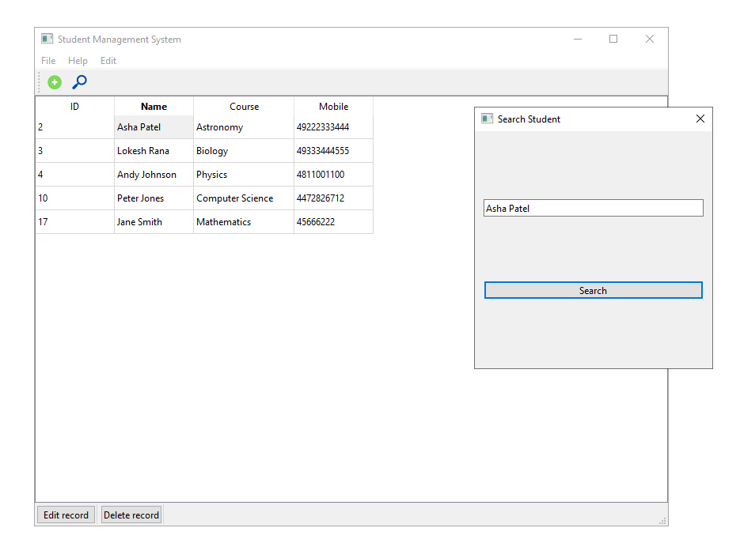
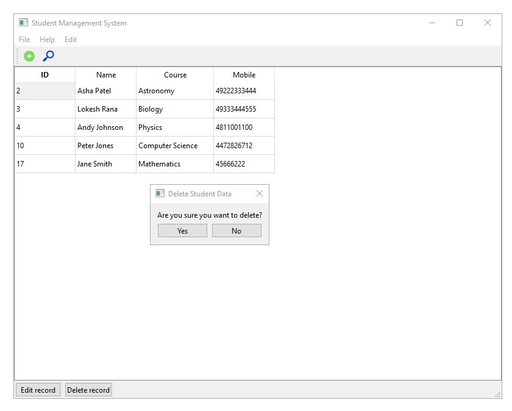

# Student Management System GUI with MySQL Database

## Table of Contents
- [Introduction](#introduction)
- [Features](#features)
- [Visuals](#visuals)
- [Prerequisites](#prerequisites)
- [Installation](#installation)

## Introduction
This is a Student Management System (SMS) Graphical User Interface (GUI) application built using PyQt6 and MySQL for efficient management of student records. The application provides various features to manage student information, including adding, editing, searching, and deleting student records. It also includes a toolbar with an "About" section to provide additional information about the application.

## Features
The Student Management System GUI with MySQL Database offers the following features:

1. **Object-Oriented Programming Style**: The application is designed using PyQt6, following Object-Oriented Programming (OOP) principles, which makes it maintainable and extensible.

2. **Search Feature**: Easily search for student records using filters like name, student ID, or other criteria, enabling quick and efficient retrieval of information.

3. **Add Student**: Add new student records to the database with details such as name, student ID, course, and contact information.

4. **Edit Students**: Modify existing student records by updating their details, ensuring accurate and up-to-date information.

5. **Delete Student**: Remove student records from the database if they are no longer needed.

6. **Toolbar with About Section**: The application includes a toolbar with an "About" section, providing users with information about the application and its creators.

## Visuals
Screeshots below 


Add feature 


Search feature 


Delete feature 


Edit feature not capture works similarly to add feature 


## Prerequisites
Before installing and running the Student Management System GUI, you should have the following prerequisites in place:

1. **Python**: Ensure that you have Python 3.x installed on your system. You can download Python from [python.org](https://www.python.org/downloads/).

2. **PyQt6**: The application is built using PyQt6, so you need to have PyQt6 installed. You can install it using pip:
   ```bash
pip install PyQt6

3. **MySQL Database**: You should have a MySQL database installed and running on your system. Make sure you have the necessary credentials (username, password) and access privileges to create and manage databases and tables.

4. **MySQL Connector**: Install the MySQL Connector/Python library to connect to the MySQL database from Python:


6. **IDE or Text Editor**: You can use any Python IDE or text editor of your choice for coding and running the application.

## Installation
Follow these steps to install and run the Student Management System GUI:

1. **Clone the Repository**: Clone or download the application repository from the provided source.

2. **Database Setup**: Create a MySQL database and the necessary tables for student records. You can find the SQL script for table creation in the repository.

3. **Configuration**: Update the database connection parameters in the application code to match your MySQL database settings.

4. **Run the Application**: Open the Python script responsible for the GUI application and run it using your Python IDE or terminal.

5. **Interact with the GUI**: Once the application is running, you can interact with the GUI to manage student records, search, add, edit, and delete students as needed.

